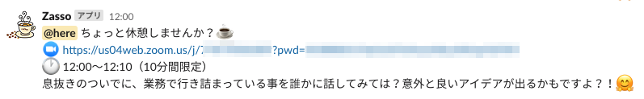

# Zasso

Zasso is instant rest room on Zoom meeting!




## Deploy

```
export AWS_PROFILE=your-aws-account-profile-name
npm run build
npm run deploy
```

Enjoy!!

## Setup

SSM に設定値３つを保存する必要があります。
アカウント識別子は[0-9a-z_-]であれば何でも構いません

(1)Slack 通知用 チャンネル名
/zasso/dev/account-manager/accounts/\${アカウント識別子}/slack-channel
通知先のチャンネルは事前に作成しておいてください

(2)Slack 通知用 WebHook URL
/zasso/dev/account-manager/accounts/\${アカウント識別子}/slack-webhook-url
WebHook URL は Slack [Custom Integrations](https://catfood.slack.com/apps/new/A0F7XDUAZ-incoming-webhooks)から発行が可能です

(3)Zoom アカウント JWT トークン
/zasso/dev/account-manager/accounts/\${アカウント識別子}/zoom-jwt-token
Zoom アカウントの JWT トークンは、Zoom のアカウントがあれば[](https://marketplace.zoom.us/develop/create)から誰でも作成可能です。（無料アカウントでも可）

例）

```bash
# SSMを保存するAWSアカウント(zassoのデプロイ先と同じ)
export AWS_PROFILE=your-aws-account-profile-name
# 休憩室を作るアカウント識別子（被らなければ適当な名前でOK）
export ACCOUNT_NAME=test-account1
# 休憩室が作られた時に通知するSlackのWebHook URL
export SLACK_WEBHOOK_URL=https://hooks.slack.com/services/RkGGS/KgfasiKdfsafDDD/lkafjDSrjiopkajklrwe
# 休憩室が作られた時に通知するSlackチャンネル
export SLACK_CHANNEL=lab_koki
# 休憩室の作成に利用するZoomアカウントのトークン
export ZOOM_JWT_TOKEN="kljjklatr3io3k12.a3t.gfasa33DD"

#
# 以下、SSMへ設定を保存
#
aws ssm put-parameter \
    --type String \
    --name "/zasso/dev/account-manager/accounts/${ACCOUNT_NAME}/slack-channel" \
    --value "${SLACK_CHANNEL}"

aws ssm put-parameter \
    --type SecureString \
    --name "/zasso/dev/account-manager/accounts/${ACCOUNT_NAME}/slack-webhook-url" \
    --value "${SLACK_WEBHOOK_URL}"

aws ssm put-parameter \
    --type SecureString \
    --name "/zasso/dev/account-manager/accounts/${ACCOUNT_NAME}/zoom-jwt-token" \
    --value "${ZOOM_JWT_TOKEN}"
```
